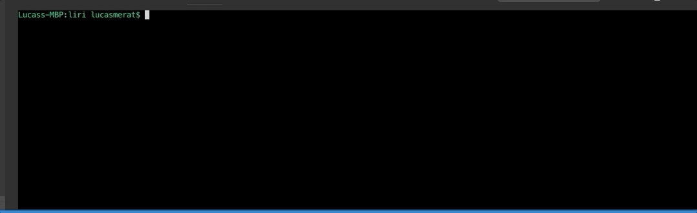

# Liri Bot

## Description
Liri is a command line application that takes requests and returns results from a variety of APIs. Each command is styled to look like the branding of the service it is pulling data from. Created for UT Bootcamp week 9. 

## Technologies used
- [Axios](https://www.npmjs.com/package/axios)
- [MomentJS](https://www.npmjs.com/package/moment)
- [Node Spotify API](https://www.npmjs.com/package/node-spotify-api)
- [OMDB API](http://www.omdbapi.com/)
- [Bands In Town API](https://manager.bandsintown.com/support/bandsintown-api)

## Install instructions
Clone thje repo to your desktop and run `npm install` to install all the dependencies.

## Use instructions
Follow along with the GIFs below to learn all available commands/features

### Spotify song info
Run the following in your command line to get relevant data from Spotify \
`node liri.js spotify-this-song [YOUR SONG HERE]`

### Upcoming concert info
Run the following in your command line to get relevant data from Bands In Town and see who is playing a showe near you \
`node liri.js concert-this [YOUR ARTIST/BAND HERE]`

### Movie info
Run the following in your command line to learn more about any movie in IMDB \
`node liri.js movie-this [YOUR MOVIE HERE]`

### Logging commands to log.txt
When you run the program, it will automatically log the command and query you made
